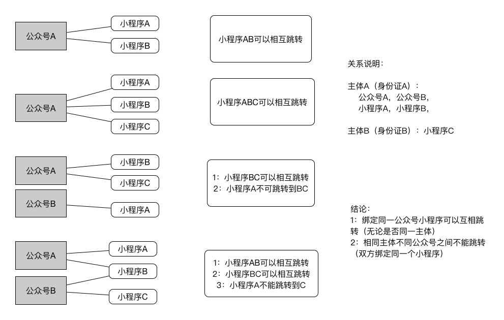

# 小程序互相跳转

## 调研说明

小程序之间可以相互跳转逻辑及限制

### 测试

主体 A（身份证 A）：公众号 A，公众号 B，小程序 A，小程序 A，
主体 B（身份证 B）：小程序 C

- first case:公众号 A 关联小程序 A，小程序 B。小程序 AB 可以互相跳转
- second case:公众号 A 关联小程序 A，小程序 B，小程序 c。小程序 ABC 可以互相跳转
- third case:公众号 A 关联小程序 A。公众号 B 关联小程序 B，小程序 c。小程序 BC 可以互相跳转，小程序 A 不可跳转 BC
- fourth case:公众号 A 关联小程序 A，小程序 B。公众号 B 关联小程序 B，小程序 c。小程序 BC 可以互相跳转，小程序 AB 可以互相跳转。小程序 AC 不可直接跳转，需要通过跳转到 B 做中转

### 结论

1. 绑定同一公众号小程序可以互相跳转（无论是否同一主体）
2. 相同主体不同公众号之间不能跳转（双方绑定同一个小程序）

同一公众号下关联的另一个小程序。（注：必须是同一公众号下，而非同个 open 账号下）

### 图文说明



## 其他说明

**关联规则**

1. 所有公众号都可以关联小程序。
2. 一个公众号可关联 10 个同主体的小程序，3 个不同主体的小程序。
3. 一个小程序可关联 500 个公众号。
4. 公众号一个月可新增关联小程序 13 次，小程序一个月可新增关联 500 次。
5. 一个身份证可以申请五个公众号

**运营规范**

- 5.3 不得在用户不知情或用户未进行任何触发操作的情况下跳转其他小程序。
- 5.10 未经腾讯书面同意，任何开发者不得自行或与其他第三方共同利用腾讯的服务对微信小程序进行推荐、推广、排行或集中设立跳转、添加平台服务，也不得为上述行为提供任何协助或便利。否则，腾讯有权对相关微信小程序采取限制功能直至封禁处理，并有权拒绝再向该主体提供服务。
- 5.11 开发者应当正当使用腾讯提供的服务，不得自行或与其他第三方共同对腾讯提供的服务进行干扰或不正当使用，包括但不限于替换跳转页面、流量劫持等。否则，一经发现，腾讯有权对相关微信小程序采取限制功能直至封禁处理，并有权拒绝再向该主体提供服务。

**跳转代码**

```javascript
wx.navigateToMiniProgram({
  appId: "appid", // 要跳转的小程序的appid
  path: "pages/index/index", // 跳转的目标页面
  envVersion: "trial", // 跳转的环境
  extarData: {
    open: "auth"
  },
  success(res) {
    // 打开成功
    console.log("成功");
  }
});
```

## 帮助链接

[公众号关联小程序](https://developers.weixin.qq.com/miniprogram/introduction/index.html#%E5%85%AC%E4%BC%97%E5%8F%B7%E5%85%B3%E8%81%94%E5%B0%8F%E7%A8%8B%E5%BA%8F)

[运营规范](https://developers.weixin.qq.com/miniprogram/product/index.html?t=18082111)

[跳转能力](https://developers.weixin.qq.com/miniprogram/dev/api/navigateToMiniProgram.html)
