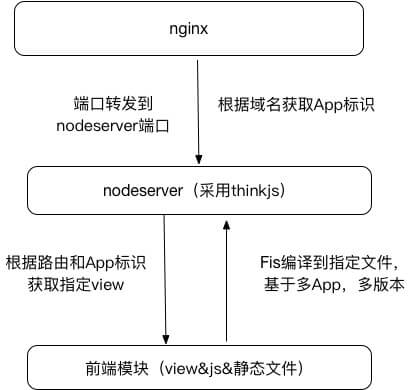
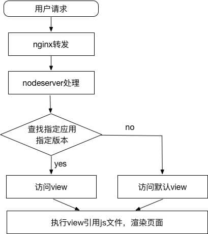
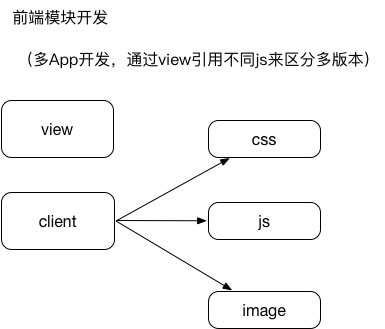

# 视频直播

该项目用来支持 APP H5, 移动端 H5 等公共模块。

## 技术栈

- 搭建 nodeserver，采用[thinkjs](https://thinkjs.org/) 2.2.x 版本

- 打包工具使用[fis3](http://fis.baidu.com/fis3/docs/beginning/release.html)

- 前端 mvc 使用[vue](https://cn.vuejs.org/v2/guide/)架构

- 使用[vue router](https://router.vuejs.org/zh-cn/ "vue router")，[vue resource](https://github.com/pagekit/vue-resource)

- 部分动画使用[animate.css](https://daneden.github.io/animate.css/)。部分大礼物动画使用[airbnb/lottie-web](https://github.com/airbnb/lottie-web)

- 统计使用百度统计和内部统计

## 项目架构

### nginx

根据访问域名获取 App 标识，转发到指定 nodeserver 端口。

### nodeserver

搭建 nodeserver，采用[thinkjs](https://thinkjs.org/) 2.2.x 架构

- 该模块主要作为前端的 server 层级
- 请求分发
- 封装配置配置，登录等必须请求
- 做多应用，多版本

### 前端模块

承载主要页面模块和业务。采用 vue 开发。

- 封装常用工具类
- 封装公共组件
- 区分多应用开发，多应用样式表配置
- 部分页面单页面开发

### fis

根据 package.json 版本，将前端模块发布到 nodeserver 指定地址。

